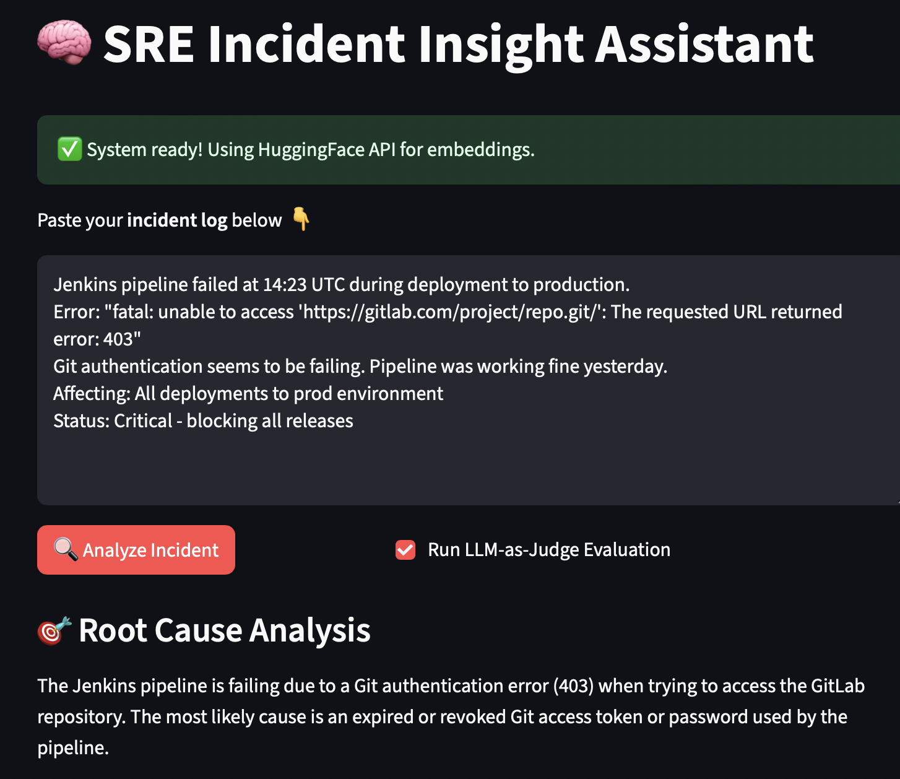
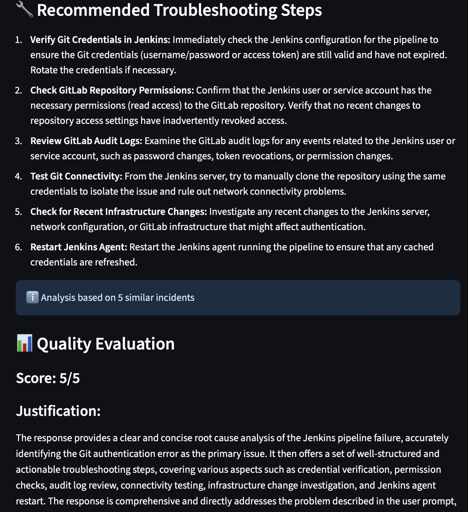

# 🛠️ Project: DevOps GPT 

You can visit the app here: https://devpost-ai-app-422329233863.us-central1.run.app


## 🔹 Goal:

An AI assistant that:

- Analyzes new incident descriptions
- Finds similar past incidents using MongoDB Vector Search
- Suggests likely causes and possible mitigation steps

Incident Example:
```
Jenkins pipeline failed at 14:23 UTC during deployment to production. 
Error: "fatal: unable to access 'https://gitlab.com/project/repo.git/': The requested URL returned error: 403"
Git authentication seems to be failing. Pipeline was working fine yesterday.
Affecting: All deployments to prod environment
Status: Critical - blocking all releases
```

## 📦 Step-by-Step Project Plan

### 1. Data Collection ✅ 

- Scrape incidents from Gitlab api 
- Save results locally to avoid rerunning heavy queries
- Store raw incident data in Atlast

### 2. Vector Embedding + MongoDB Atlas ✅ 

- Generate embeddings  
- Store embeddings in MongoDB Atlas Vector Store 
- Use MongoDB’s Vector Search to retrieve semantically similar past incidents

### 3. Build AI Incident Assistant ✅

- User pastes a new incident log into the UI
- App does:
    - Embed the input
    - Query MongoDB to find 3 most similar incidents
    - Use LLM (Gemini 2.0 Flash) to:
        - Summarize common root causes
        - Recommend first troubleshooting steps
    - Use LLM-as-Judge to evaluate responses

## App Screenshot






## Deployment

## 1. Test locally first

Build the docker image using `docker build --platform linux/amd64 -t gcr.io/$PROJECT_ID/devpost-ai-app .`

Check the image exists using `docker images`

Run it locally using `docker run -p 8080:8080 --env-file .env devpost-ai-app`

Authenticate Docker with Google Cloud `gcloud auth configure-docker`
`docker push gcr.io/$PROJECT_ID/devpost-ai-app`

## 2. GCP Setup

### Create GCP secrets using:
```bash
chmod +x utils/create_secrets.sh
./utils/create_secrets.sh 
```

### Set GCP Project:
```bash
export PROJECT_ID=<name-of-project>
gcloud projects create $PROJECT_ID 
gcloud config set project $PROJECT_ID 
```

### Enable services:
```bash
gcloud services enable run.googleapis.com 
gcloud services enable containerregistry.googleapis.com 
gcloud services enable cloudbuild.googleapis.com  
gcloud services enable secretmanager.googleapis.com 
```

## 3. Deploy to Cloud

If local test works, deploy to Cloud: `gcloud builds submit --tag gcr.io/$PROJECT_ID/devpost-ai-app .`

### Grant secret manager permissions 
```bash
PROJECT_NUMBER=$(gcloud projects describe $PROJECT_ID --format="value(projectNumber)")
SERVICE_ACCOUNT="${PROJECT_NUMBER}-compute@developer.gserviceaccount.com"

gcloud projects add-iam-policy-binding $PROJECT_ID \
  --member="serviceAccount:$SERVICE_ACCOUNT" \
  --role="roles/secretmanager.secretAccessor"
```

MongoDB only allows whitelisted IPs. You can connect GCP using VPC Peering but it's not free. So as a workaround, I'm using  Google Cloud's NAT Gateway with Static IP since it's free and gives a consistent static IP for MongoDB Atlas whitelisting.

### NAT Gateway
```bash
# Get the static IP to add to MongoDB Atlas
gcloud compute addresses describe mongodb-static-ip --region=us-central1 --format="get(address)"
```
Take the IP from the above command and add it to MongoDB Atlas Network Access.

Create the router:
```bash
gcloud compute routers create mongodb-router \    --network=default \
    --region=us-central1
```
Create the NAT gateway:
```bash
# You created the router, now create the NAT gateway with your static IP
gcloud compute routers nats create mongodb-nat --router=mongodb-router --region=us-central1 --nat-external-ip-pool=mongodb-static-ip --nat-all-subnet-ip-ranges
```

Create the VPC Connector:
```bash
# This connects Cloud Run to your VPC (which has the NAT)
gcloud compute networks vpc-access connectors create mongodb-connector \
  --network=default \
  --region=us-central1 \
  --range=10.8.0.0/28
```

### Deploy to Cloud Run
```bash
gcloud run deploy devpost-ai-app \
  --image gcr.io/$PROJECT_ID/devpost-ai-app \
  --region us-central1 \
  --platform managed \
  --allow-unauthenticated \
  --port 8080 \
  --memory 4Gi \
  --cpu 2 \
  --max-instances 10 \
  --timeout 900 \
  --vpc-connector mongodb-connector \
  --vpc-egress all-traffic \
  --set-env-vars="GOOGLE_CLOUD_PROJECT=$PROJECT_ID,DB_NAME=gitlab,COLLECTION_NAME=incidents,GITLAB_URL=https://gitlab.com,GITLAB_PROJECT_URL=gitlab-com/gl-infra/production,INCIDENTS_PATH=data/incidents.pkl"
```

or 
```bash
gcloud run services replace service.yaml --region us-central1
```

